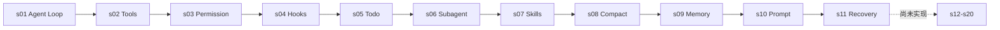

# Learn Claude Code — LangChain Agent Harness 版

本项目参考 [shareAI-lab/learn-claude-code](https://github.com/shareAI-lab/learn-claude-code) 的 20 章编排，用 **LangChain 1.x + LangGraph + OpenAI-compatible ChatModel** 重新实现同一组 Agent Harness 概念。

> Agency 来自模型，Agent 产品 = 模型 + Harness。

模型负责理解、推理和决策；Harness 负责工具执行、权限、生命周期、上下文、记忆、委派与恢复。本项目的目标不是重新发明模型，而是用逐章可运行的 LangChain 代码理解 Claude Code 一类 coding agent 的工程机制。

## 核心模式

参考仓库手写模型/工具循环；LangChain 版本把这段循环交给 `create_agent` 构建的 LangGraph runtime：

```python
import os

from langchain.agents import create_agent
from langchain_openai import ChatOpenAI

model = ChatOpenAI(
    model=os.environ["MODEL_ID"],
    api_key=os.environ["deepseek_api_key"],
    base_url=os.environ["BASE_URL"],
    temperature=0,
)
agent = create_agent(model=model, tools=TOOLS, system_prompt=SYSTEM)
result = agent.invoke({"messages": [{"role": "user", "content": query}]})
```

模型输出 `tool_calls` 时，runtime 执行工具并追加 `ToolMessage`，然后再次调用模型；模型不再调用工具时，本轮结束。后续章节都在这个闭环上增加 middleware、state 和持久化机制。

## 当前范围

- s01～s10：已有 LangChain 实现。
- s11：已有恢复策略构件，但还没有完成 middleware 与 Agent 装配。
- s12～s20：仅建立章节目录和空 `code.py`，等待后续实现。
- 每章 README 的教学部分已替换为 LangChain 代码；折叠区“深入 CC 源码”保留参考仓库原文，方便对照真实 Claude Code Harness。

## 快速开始

Windows PowerShell：

```powershell
python -m venv venv
.\venv\Scripts\Activate.ps1
pip install -r requirements.txt
Copy-Item .env.example .env
# 编辑 .env 后运行任一已实现章节
python -m s01_agent_loop.code
```

`.env` 至少需要：

```dotenv
MODEL_ID=your-model-id
deepseek_api_key=your-api-key
BASE_URL=https://your-openai-compatible-endpoint/v1
```

如果 s11 使用备用模型，再设置 `FALLBACK_MODEL_ID`。不要提交真实 `.env`。

## 学习路径



## 全部章节

| # | 章节 | 机制 | 状态 |
|---:|---|---|---|
| 01 | [s01: Agent Loop](s01_agent_loop/) | 最小 Agent 闭环 | ✅ 已实现 |
| 02 | [s02: Tool Use](s02_tool_use/) | 结构化文件与命令工具 | ✅ 已实现 |
| 03 | [s03: Permission](s03_permission/) | deny、规则与用户确认 | ✅ 已实现 |
| 04 | [s04: Hooks](s04_hooks/) | 生命周期扩展点 | ✅ 已实现 |
| 05 | [s05: TodoWrite](s05_todo_write/) | 任务内计划与流式进度 | ✅ 已实现 |
| 06 | [s06: Subagent](s06_subagent/) | 隔离上下文的委派 | ✅ 已实现 |
| 07 | [s07: Skill Loading](s07_skill_loading/) | Skills 渐进加载 | ✅ 已实现 |
| 08 | [s08: Context Compact](s08_context_compact/) | 多层上下文压缩 | ✅ 已实现 |
| 09 | [s09: Memory](s09_memory/) | Markdown 长期记忆 | ✅ 已实现 |
| 10 | [s10: System Prompt](s10_system_prompt/) | 动态 system prompt | ✅ 已实现 |
| 11 | [s11: Error Recovery](s11_error_recovery/) | 恢复组件草稿（未完成装配） | 🟡 草稿 |
| 12 | [s12: Task System](s12_task_system/) | 等待 LangChain 实现 | ⬜ 占位 |
| 13 | [s13: Background Tasks](s13_background_tasks/) | 等待 LangChain 实现 | ⬜ 占位 |
| 14 | [s14: Cron Scheduler](s14_cron_scheduler/) | 等待 LangChain 实现 | ⬜ 占位 |
| 15 | [s15: Agent Teams](s15_agent_teams/) | 等待 LangChain 实现 | ⬜ 占位 |
| 16 | [s16: Team Protocols](s16_team_protocols/) | 等待 LangChain 实现 | ⬜ 占位 |
| 17 | [s17: Autonomous Agents](s17_autonomous_agents/) | 等待 LangChain 实现 | ⬜ 占位 |
| 18 | [s18: Worktree Isolation](s18_worktree_isolation/) | 等待 LangChain 实现 | ⬜ 占位 |
| 19 | [s19: MCP & Plugin](s19_mcp_plugin/) | 等待 LangChain 实现 | ⬜ 占位 |
| 20 | [s20: Comprehensive](s20_comprehensive/) | 等待 LangChain 实现 | ⬜ 占位 |

## 目录约定

```text
learn_claude_code/
├── s01_agent_loop/
│   ├── code.py
│   ├── code_commented.py
│   ├── code_uncommented.py
│   ├── images/
│   └── README.md
├── ...
├── s11_error_recovery/
│   ├── code.py
│   └── README.md
├── s12_task_system/ ... s20_comprehensive/
│   ├── code.py              # 空占位
│   └── README.md            # 状态说明
├── skills/                  # s07 可扫描的示例 Skills
├── .env.example
└── requirements.txt
```

已有章节中的 `code.py` 是主版本；`code_commented.py` 与 `code_uncommented.py` 分别适合逐行学习和快速通读。原来的 s03.5、s05.5 已分别归档为 `code_middleware.py` 与 `code_streaming.py`。

## 说明与致谢

章节命名、教学脉络、插图和“深入 CC 源码”内容来自或改编自 [shareAI-lab/learn-claude-code](https://github.com/shareAI-lab/learn-claude-code)，原项目采用 MIT License。LangChain 实现代码以本目录现有脚本为准；两者行为不完全等价，README 会明确指出未完成部分。
