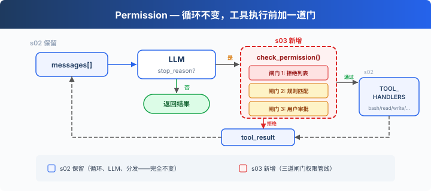

# s03: Permission — 安全地让 Agent 行动

> LangChain 教学改编版。章节结构与“深入 CC 源码”部分主要参考 [shareAI-lab/learn-claude-code](https://github.com/shareAI-lab/learn-claude-code)。
>
> **Harness 层**：权限系统 — deny、规则判断与用户确认。

[s02](../s02_tool_use/) → **s03** → [s04](../s04_hooks/)

---

## 问题

Agent 拿到写文件和执行命令的能力后，必须区分明确禁止、需要确认和可以自动执行的操作。

---

## 解决方案



本章保留两种 LangChain 写法：基础版在工具入口调用 `check_permission()`；增量版用 `AgentMiddleware.wrap_tool_call()` 在统一分发层完成检查。

---

## 工作原理：LangChain 版本

```python
class PermissionMiddleware(AgentMiddleware):
    def wrap_tool_call(self, request, handler):
        name = request.tool.name if request.tool else request.tool_call["name"]
        args = request.tool_call.get("args", {})
        if not check_permission(name, args):
            return ToolMessage(
                content="Permission denied",
                tool_call_id=request.tool_call["id"],
                name=name,
                status="error",
            )
        return handler(request)

agent = create_agent(
    model=MODEL,
    tools=TOOLS,
    system_prompt=SYSTEM,
    middleware=[PermissionMiddleware()],
)
```

检查顺序与参考仓库一致：deny list 先硬拒绝，再由规则判断是否需要询问用户，最后才调用真实工具。

---

## 本章文件

`code.py` 是基础版；`code_middleware.py` 是 s03.5 中间件版；两组代码都保留 commented/uncommented 变体。

---

## 试一下

先在仓库根目录准备环境，然后从根目录按模块运行：

```powershell
python -m venv venv
.\venv\Scripts\Activate.ps1
pip install -r requirements.txt
Copy-Item .env.example .env
python -m s03_permission.code
```

> 这些教学 Agent 可以执行命令和修改文件。建议先在测试目录中试用，并认真阅读每次权限提示。

---

## 接下来

权限检查做了——但每次都在循环里硬编码 `check_permission()`。如果我想在每次工具执行前后加日志？如果想在某些操作后自动触发 git commit？这些扩展逻辑散落在 loop 里，循环很快就会膨胀。

s04 Hooks → 给循环加钩子，扩展逻辑挂在钩子上，循环保持干净。


<details>
<summary>深入 CC 源码</summary>

> 以下基于 CC 源码 `types/permissions.ts`、`utils/permissions/permissions.ts`、`toolExecution.ts`、`utils/permissions/yoloClassifier.ts`、`tools/AgentTool/forkSubagent.ts` 的核查。

### 一、PermissionResult：不是 3 种，是 4 种

教学版的三道闸门（deny → ask → allow）和 CC 不完全对应。CC 的 `PermissionResult` 有 4 个 behavior（`types/permissions.ts:241-266`）：

| behavior | 含义 | 教学版对应 |
|----------|------|-----------|
| `allow` | 直接允许 | 闸门 3 通过 |
| `deny` | 直接拒绝 | 闸门 1 命中 |
| `ask` | 弹出对话框问用户 | 闸门 2 命中 |
| `passthrough` | 工具不表态，交给通用管线决定 | 教学版无 |

### 二、生产版的验证阶段

CC 的工具调用不是经过三道闸门，而是经过多个阶段，分布在 `checkPermissionsAndCallTool()`（`toolExecution.ts:599-1745`）、hooks、`hasPermissionsToUseToolInner()`（`utils/permissions/permissions.ts:1158-1310`）和 classifier 逻辑里：

1. **Zod schema 验证**（`toolExecution.ts:614-680`）— 参数类型检查
2. **validateInput()**（`toolExecution.ts:682-733`）— 工具级语义验证
3. **backfillObservableInput()**（`toolExecution.ts:784`）— 补全遗留字段
4. **PreToolUse hooks**（`toolExecution.ts:800-862`）— 钩子可以返回 allow/deny/ask
5. **resolveHookPermissionDecision()**（`toolExecution.ts:921-931`）— 协调钩子+管线决策
6. **hasPermissionsToUseToolInner()**（`permissions.ts:1158-1310`）— 多层规则检查：
   - 整个工具被 deny rule 禁用 → `deny`
   - 整个工具被 ask rule 标记 → `ask`
   - `tool.checkPermissions()` 工具自己的判断
   - 工具自己返回 deny → `deny`
   - `requiresUserInteraction()` → `ask`
   - 内容相关的 ask 规则 → `ask`（不可绕过）
   - 安全检查违规 → `ask`（不可绕过）
   - bypassPermissions 模式 → `allow`
   - 整个工具被 allow rule 放行 → `allow`
   - passthrough → 转为 `ask`

### 三、拒绝列表：不是一个文件，是 8 个来源

CC 没有单一的 deny list。权限规则来自 8 个来源（`types/permissions.ts:54-62`）：

| 来源 | 配置位置 |
|------|---------|
| `userSettings` | `~/.claude/settings.json` |
| `projectSettings` | `.claude/settings.json` |
| `localSettings` | `settings.local.json` |
| `flagSettings` | Feature flags |
| `policySettings` | 企业管理策略 |
| `cliArg` | `--allowedTools` / `--deniedTools` |
| `command` | 内联命令 |
| `session` | 会话内临时授权 |

每条规则格式：`{ toolName: "Bash", ruleBehavior: "deny", ruleContent: "npm publish:*" }`。多个来源的规则合并，高优先级来源覆盖低优先级（从低到高：user < project < local < flag < policy，加上 cliArg、command、session）。

### 四、isDestructive() 是什么

CC 中 `isDestructive`（`Tool.ts:405-406`）**纯粹是 UI 展示用的**——在工具列表里显示 `[destructive]` 标签。它不参与权限决策。默认所有工具都返回 `false`。只有 ExitWorktree（remove 时）和 MCP 工具（依赖 `annotations.destructiveHint`）覆写了它。

### 五、YoloClassifier（自动审批）

CC 的 auto 模式下，不会每次都弹对话框。`classifyYoloAction`（`utils/permissions/yoloClassifier.ts:1012`）把工具调用 + 对话上下文发给一个分类器 LLM 判断是否安全。先尝试 acceptEdits 模式模拟（`permissions.ts:620-656`，如果 acceptEdits 允许 → 直接批准），再查安全工具白名单（`permissions.ts:658-686`），最后才调分类器。分类器连续拒绝太多次 → 回退到人工审批。

### 六、权限冒泡

子 Agent（通过 AgentTool fork 出来的）的 `permissionMode` 设为 `'bubble'`（`forkSubagent.ts:50`）。意思是权限弹窗**冒泡到父 Agent 的终端**，而不是在子 Agent 里静默拒绝。Bash 分类器在这个过程中继续跑——给权限对话框显示的同时在后台判断是否可以自动批准。

### 教学版的简化是刻意的

- 多阶段管线 → 3 道闸门：理解门槛大幅降低
- 8 个规则来源 → 1 个本地 DENY_LIST：概念量可控
- isDestructive → 忽略（教学版没有 UI 层，CC 里它也不参与权限决策）
- YoloClassifier → 省略（依赖于额外的 LLM 调用和遥测系统）
- 权限冒泡 → 省略（s15 才涉及多 Agent）

</details>

<!-- translation-sync: zh@v1, en@v1, ja@v1 -->
